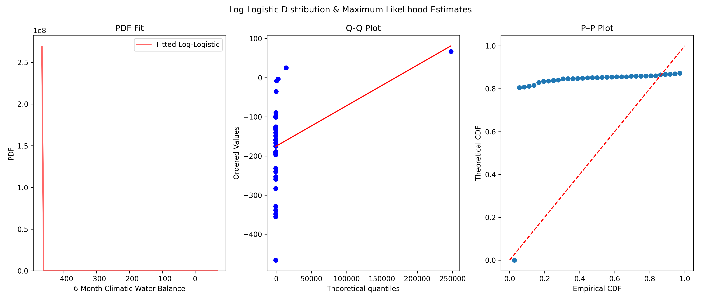
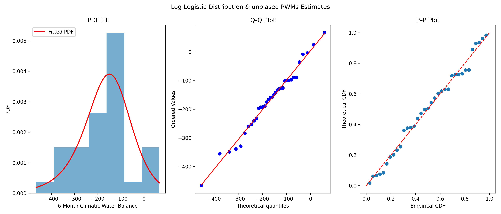
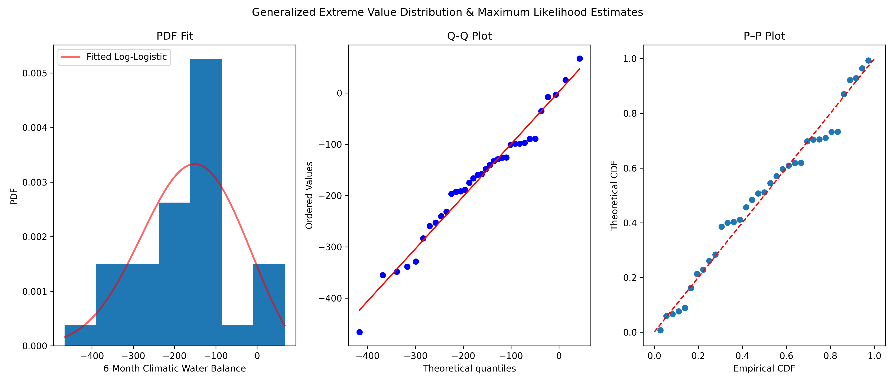
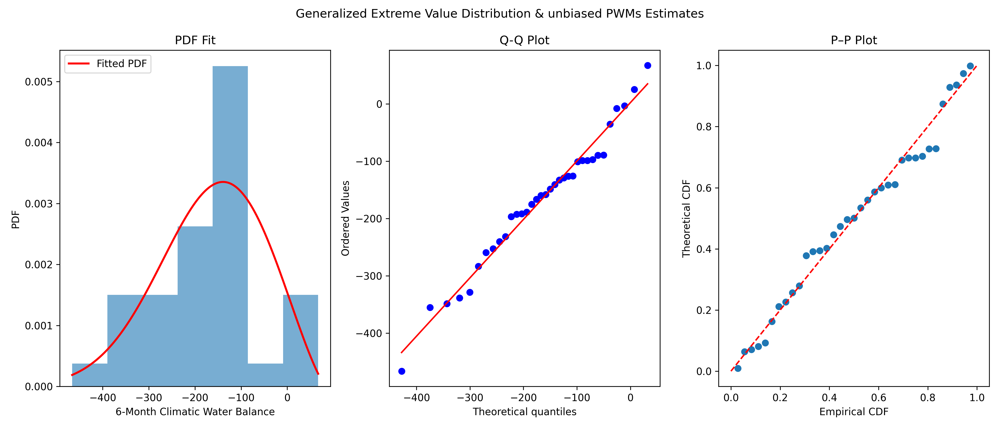
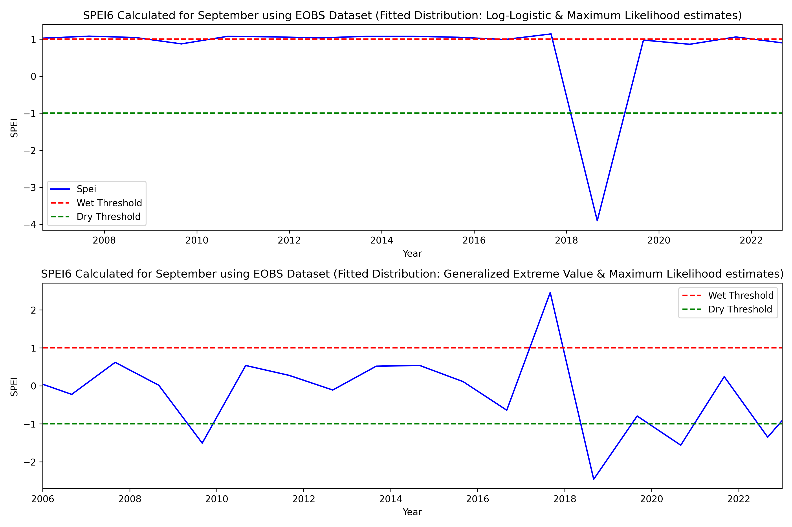
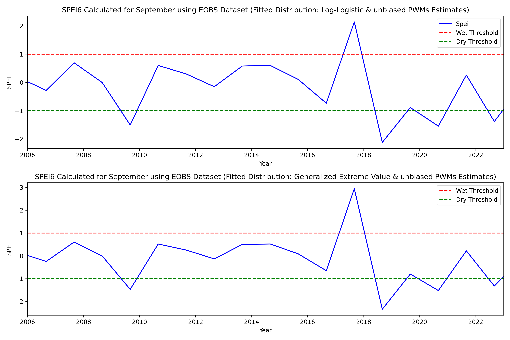

# eobs-fao56-spei-analysis

# E-OBS Hydro-Statistical Analysis: FAO-56 PET & SPEI Fitting

This repository features  workflow for drought analysis at the **Hamerstorf Agricultural Experimental Site** (Germany). The project integrates raw European gridded climate data (E-OBS) with estimation of evapotranspiration and a comparative statistical study of drought index parameter estimation.

## Source Information
- **Source:** [E-OBS European Gridded Dataset](https://www.ecad.eu/download/ensembles/download.php)
- **Resolution:** 0.1 degree (~10 km)
- **Input Variables & Preprocessing:** 
  - **Precipitation (mm):** Total daily liquid water equivalent.
  - **Temperature (°C):** Daily Mean, Max, and Min measured at 2m.
  - **Relative Humidity (%):** Daily mean relative humidity.
  - **Wind Speed (m s⁻¹):** Measured at 10m height. 
    - *Conversion:* Adjusted to 2m height ($u_2$) using the FAO-56 logarithmic profile.
  - **Radiation (W m⁻²):** Surface shortwave downwelling radiation.
    - *Conversion:* Converted to daily energy flux ($MJ \cdot m^{-2} \cdot d^{-1}$) to meet `pyet` input standards.
  - **Latitude (Degrees):** 
    - *Conversion:* Converted to **Radians** to enable accurate calculation of solar declination and extraterrestrial radiation ($R_a$).
  - **Elevation (m):** Site altitude used to adjust atmospheric pressure and psychrometric constants.

    
## Study Site: Hamerstorf
- **Location:** Lower Saxony, Germany
- **Context:** A key site for evaluating hydrological extremes, crop water demand, and the performance of gridded climate products against point-scale agricultural needs.

## Evapotranspiration
Reference Evapotranspiration (ET0) was calculated using the full **FAO-56 Penman-Monteith equation**  via the **`pyet`** library.

## Statistical Analysis: SPEI-6 (September)
The analysis focuses on the 6-month SPEI ending in September, capturing the cumulative water balance ($P - ET_0$) across the primary German growing season (April–September).

### Parameter Estimation Comparison
A core feature of this project is the robust comparison of distribution fitting for the September water balance:
1.  **Distributions:** Log-Logistic (Standard SPEI) vs. Generalized Extreme Value (GEV).
2.  **Estimation Methods:**
    - **Maximum Likelihood Estimation (MLE):** Standard frequentist optimization.
    - **Probability Weighted Moments (PWM):** Known for superior performance in hydrological extremes and smaller samples.

## Workflow Summary
1.  **Data Extraction:** Identifying and filling missing values in the E-OBS time series.
2.  **Downscaling:** Bilinear interpolation to the Hamerstorf site coordinates.
3.  **Preprocessing & Unit Conversion:** 
    *   **Wind:** 10m to 2m height correction ($u_{10} \to u_2$).
    *   **Radiation:** Flux to energy density ($W \cdot m^{-2} \to MJ \cdot m^{-2} \cdot d^{-1}$).
    *   **Coordinates:** Decimal degrees to **Radians** for solar position algorithms.
4.  **ET0 Calculation:** Generating daily PET series using `pyet.pm_fao56`.
5.  **Fitting & Comparison:** Evaluating MLE vs. PWM for drought tail-behavior stability.

## Results & Statistical Fitting

### Log-Logistic Distribution (Standard SPEI)
| MLE Fitting | Unbiased PWM Fitting |
| :---: | :---: |
|  |  |

### Generalized Extreme Value (GEV) Distribution
| MLE Fitting | Unbiased PWM Fitting |
| :---: | :---: |
|  |  |

### Comparison of Fitting Methods

